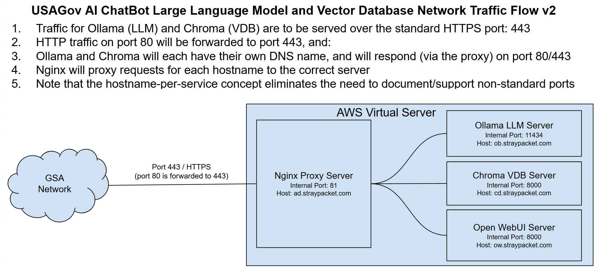
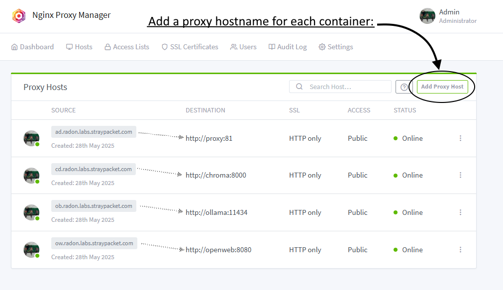

# A pipeline for importing USA.gov static html into an LLM+VDB

## Updated summary of current state (LLM server side):
1. A LLM/VDB server configuration is included in repo
1. There is a terraform configuration for an AWS implementation of the virtual hardware
1. The server is container based, and hosts Ollama and ChromaDB services via an ngix proxy server
1. The proxy server implements several value-add features, most importantly DNS proxy to the internal Ollama and ChromaDB containers and TLS certificate management

### Example Backend Architecture

### Proxy admin UI, implementing the container routing

## Updated summary of current state (LLM client side):
1. Implementations of chunking and embedding processes are available in both [PHP](./php/README.md) and [Python](./python/README.md)
1. Implementations of simple LLM query scripts which access the RAG data in the VDB are available in [PHP](./php/README.md) and [Python](./python/README.md)

## Mostly outdated sections follow:
USAgov has created a small team to implement a proof of concept application for a USAgov-specific chatbot.
This document will outline steps taken to stand up a development environment to support the import of the USA.gov html files into a local-only LLM.

## Considerations for proof of concept implementation

1. This information is meant to be used from a DevOps perspective, therefore tools and tactics will be command-line-centric (MacOS, Linux, WSL2 should all work similarly)
1. The POC should be kept "lean and mean", in order to get a working demo as soon as possible
1. The model and environment must be small enough to reside on a standard USA.gov developer workstation
1. The data must be kept local-only, meaning no online AI services should be used
1. Data processing (text extraction, tokenization and ingestion) should not impose a time/resource burden to the workstation
1. Everything should be open source (or at least free of charge at this stage)
1. No accounts should be neccesary for any external tools or data used in the POC

## Local Environment Setup

There are many tools/methods available for setting up a local dev environment for AI work.  
The tools chosen for this POC were Open-WebUI and Ollama.  There are also a plethora of 
Python tools for performing work on LLM tasks.  Quite a few were used to implement the pipeline.

1. [Install Open-WebUI and Ollama](Documentation/Local%20installation%20of%20Open-WebUI%20and%20Ollama.md)
1. [Update python version and libraries for LLM processing](Documentation/Python%20Setup%20for%20LLM.md)

## Asking the model about the steps needed to import custom data into itself

The term for augmenting a model with custom (e.g. domain-specific) data is _Retrieval-augmented Generation_

Once the local model was installed and working, the following prompt was supplied: _"How can I import documents into my local ollama model to enable Retrieval-augmented Generation?"_

The link to it's answer is [Llama 3.2 explains implementing RAG in a local environment](Documentation/Llama%203.2%20explains%20implementing%20RAG%20in%20a%20local%20environment.md)

The answers it provided were used to navigate the steps listed below.

## Extracting relevant data from USA.gov HTML files

The USA.gov HTML files are, for the purposes of this POC, generated and extracted from a locally built docker image of the USA.gov CMS application.  The extraction focuses on locating the the CSS tags used
on the HTML elements containing crucial text, and writing just that text into data files.

1. Copy the USA.gov html files from a locally running CMS container: [copy-static-site-from-local.sh](copy-static-site-from-local.sh)
1. Extract the interesting text from the html files: [extract_html_text.py](extract_html_text.py)

## Tokenizing data into LLM-compatible formats

The data files created by the extraction script are processed through various common tokenizers, which
translate human-readable text into formats understandable by the target LLM.

A shotgun approach was taken with regard to tokenizers, as it's unclear which will be "best" for ingestion into the model. [tokenize_extracted_text.py](tokenize_extracted_text.py)

## Ingesting the tokenized data into the LLM

TBD

## Creating a training data set

TBD

## Testing the trained model

TBD
