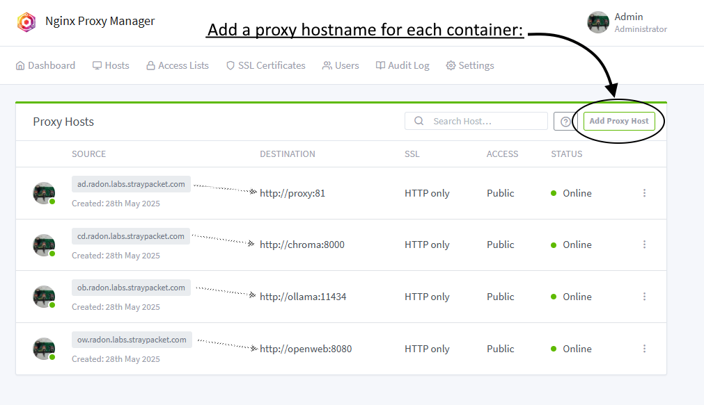

# A pipeline for importing USA.gov static html into an LLM+VDB

## Summary of LLM+VDB server side
1. The services are container based, and include Ollama and ChromaDB services as well as an optional-to-use ngix proxy server, for non-local implementations
1. A LLM/VDB/Proxy docker configuration is included in repo
1. There is a terraform configuration for an AWS implementation of the virtual hardware

### Backend Architecture

The proxy server implements several value-add features, most importantly DNS proxy to the internal Ollama and ChromaDB containers and TLS certificate management

### Proxy admin UI, implementing the container routing

